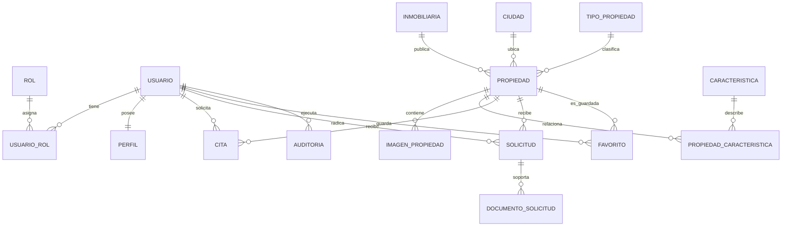

# Modelo relacional

## Diagrama lógico

## Tablas y normalización

- `usuario` y `perfil` implementan la relación 1:1.
- `inmobiliaria`, `ciudad` y `tipo_propiedad` se relacionan 1:N con `propiedad`.
- `propiedad` e `imagen_propiedad` representan una relación 1:N para la galería.
- `propiedad` y `caracteristica` se resuelven con `propiedad_caracteristica` como relación N:M.
- `usuario` y `propiedad` se relacionan mediante `cita`, `solicitud` y `favorito` según el caso.
- Las claves únicas principales son correo, documento, matrícula inmobiliaria, nombres de catálogos y correo/nombre de inmobiliaria.

El DDL completo se encuentra en `database/01_schema.sql` y los datos de demostración en `database/02_seed.sql`.
